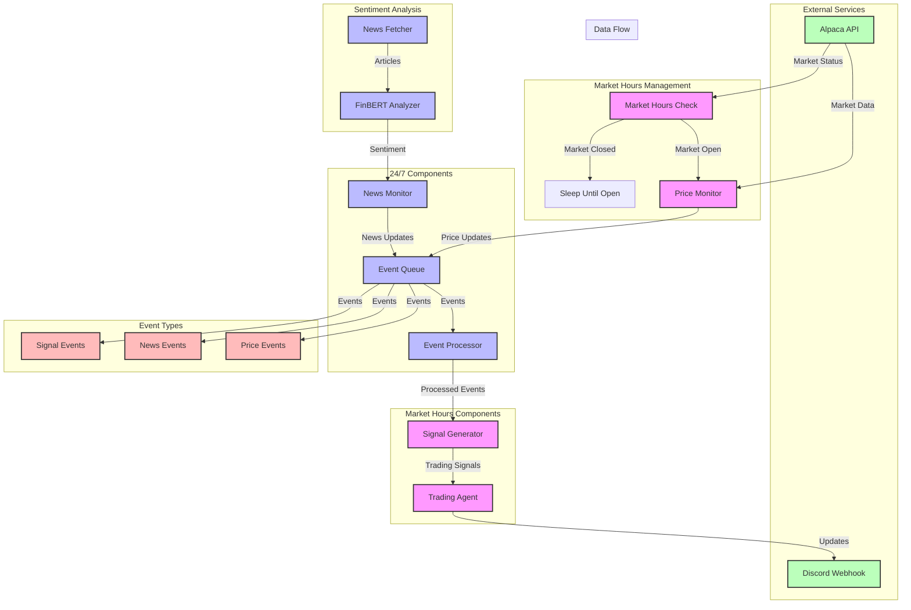

# Trading Agent System Architecture

## Component Descriptions

### Market Hours Management
- **Market Hours Check**: Continuously monitors market status
- **Price Monitor**: Tracks real-time price data during market hours
- **Sleep**: Manages system state during market closed hours

### 24/7 Components
- **News Monitor**: Continuously monitors news and sentiment
- **Event Queue**: Central message bus for all system events
- **Event Processor**: Processes and routes events

### Market Hours Components
- **Signal Generator**: Generates trading signals based on data
- **Trading Agent**: Makes trading decisions and manages positions

### External Services
- **Alpaca API**: Provides market data and trading capabilities
- **Discord Webhook**: Sends real-time updates and alerts

### Sentiment Analysis
- **News Fetcher**: Retrieves news articles
- **FinBERT Analyzer**: Analyzes sentiment of news

### Event Types
- **Price Events**: Real-time price updates
- **News Events**: News and sentiment updates
- **Signal Events**: Trading signals and decisions 